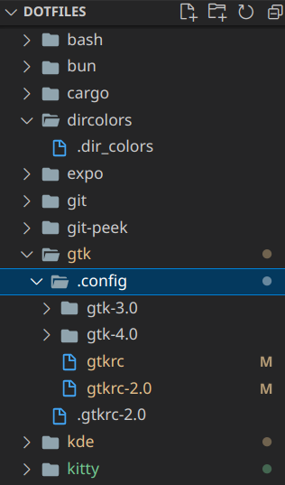
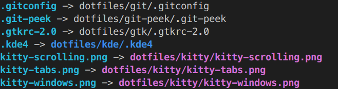
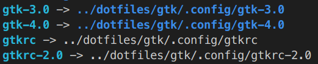

# version control .dotfiles without making home a git repo

first setup a directory to hold config

```sh
mkdir ~/dotfiles
cd dotfiles
git init
```

then put relevant config from home direectory in there nested in the same manner as home.

for instance for gtk:

```sh
mkdir ~/dotfiles/gtk
mv ~/gtk* ~/dotfiles/gtk
mv ~/.gtk* ~/dotfiles/gtk
mkdir ~/dotfiles/gtk/.config
mv ~/.config/gtk* ~/dotfiles/gtk/.config
```



then symlink them back into home with `stow`

```sh
cd ~/dotfiles
stow gtk
```

check your symlinks:

```sh
ls -la ~/
```



```sh
ls -la ~/.config/
```



commit all your config to your dotfiles git repo :)

on a new machine you can clone your dotfiles and stow each directory as appropriate
